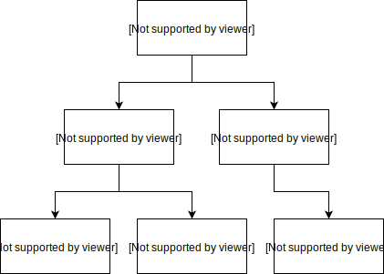

- Feature Name: state-pruning
- Start Date: 2018-03-21
- RFC PR: (leave this empty)
- Sawtooth Issue: (leave this empty)

# Summary
[summary]: #summary

This RFC describes a method for _State Pruning_.  State Pruning refers to the
process of discarding older roots from the Merkle-Radix tree in an effort to
manage growth of the State Database over time.

# Motivation
[motivation]: #motivation

Currently, the State Database is allowed to grow in an unconstrained manner,
consuming a large amount of disk space over the lifetime of a given ledger. This
presents significant challenges to maintaining a ledger over a long period of
time. Reducing the state database size will result in longer term stability of a
running ledger.

# Guide-level explanation
[guide-level-explanation]: #guide-level-explanation

State Pruning is implemented via the following:

The Sawtooth Merkle-Radix tree implementation is a copy-on-write data structure.
This means that only nodes that have changed, via updates or inserts, are added
to the tree and hashed.  Unchanged nodes are not modified or hashed, only
referenced by the modified nodes in the tree.  Delete nodes are no longer
referenced, which results in the parent nodes' hashes being updated.

Along side the serialized node, a reference count (RC) is stored. A reference
count for a given node is incremented when it is referenced by a new parent.  It
is decremented when it is no longer referenced by a previous parent.

A simplified tree will be used as an example:



The above example consists of a trie of depth 3, with 3 leaves.  The
intermediate nodes consist of branches and the computed hashes.

If an operation occurs that modifies the value of `Leaf3`, the trie will now
look like:


Here we can see that a new `Leaf3'` and `Node2'` is added, but the original
`Node1` is still a member of the trie, with a reference count increased by 1. In
otherwords, that node is referenced by both `Root` and `Root'`.

If state pruning was to occur against the original `Root` the following
operations would occur:

- `Root` is deleted
- `Root`'s children would have their reference counts decremented
    - As a result, `Node1` would have `RC = 1`; `Node2` would now have `RC = 0`
- `Node2` would be deleted, given that its RC is 0
- `Node2`'s children would have the reference counts decremented
    - As a result, `Leaf3` would have `RC = 0`
- `Leaf3` would be deleted

In a running Sawtooth validator, state pruning would occur against state roots
that are either a certain depth in the tree, or abandoned forks.  The block
maximum block depth is configurable, and will default to `1000`.

In order to track forks efficiently, all root nodes have a RC of 1.  When a fork
is abandoned, the root associated with the fork will be decremented to 0.  All
root nodes are maintained in a `root_node` index, which can be iterated over
efficiently.

**Database Compaction**

After a set number of pruning phases, the database has a large amount of
reclaimed space, which needs to be compacted.  This is an additional step
required to keep the overall file size smaller.  It is not an automatic process
for LMDB.

# Reference-level explanation
[reference-level-explanation]: #reference-level-explanation

## Configuration

Maximum block depth is a local configuration option.  It is set via the command
line parameter `--state-pruning-block-depth` and defaults to `1000`.

This is a local setting, as pruning helps manage local resource constraints.
Network-wide settings have no knowledge of local disk size issues.

## Reference Count Storage 

Reference Counts are stored in a child database, `metadata`, which will record
metadata in a protobuf message.  This will only contain the reference count, but
allow for future metadata.

```
message StateEntryMetaData {
    uint32 ref_count= 1;
}
```

These counts are updated in the child database during the update of the main
state database, within the same write transaction.  This preserves the
atomicity of the writes.

## Updating Entries

After computing the updated hashes, before writing the data to disk, the
resulting updates are walked and the reference counts are added to an additional
update set.  The additional update set is applied to the reference count child
database.

The operation follows two phases: collecting referenced hashes during the hash
computation for the given changes, and updating the reference counts for that
set of hashes.

Collecting the hashes requires the following changes to the existing algorithm:

```
         # Rebuild the hashes to the new root
+        referenced_hashes = set()
         for path in sorted(path_map, key=len, reverse=True):
             (key_hash, packed) = _encode_and_hash(path_map[path])
             update_batch.append((key_hash, packed))
             if path != '':
                 parent_address = path[:-TOKEN_SIZE]
                 path_branch = path[-TOKEN_SIZE:]
                 path_map[parent_address]['c'][path_branch] = key_hash
+                for child_hash in path_map[parent_address]['c'].keys():
+                    referenced_hashes.add(child_hash)
```

Storing the hashes requires the following additions (in psuedo code):

```
    let metadata = StateEntryMetaData()
    for hash in referenced_hashes:
        metadata.ParseString(read_metadata(hash))
        metadata.ref_count += 1
        write_metadata(hash, metadata.SerializeString())
        metadata.Clear()
```
        

## Pruning

Pruning is a simple operation of walking the trie from a given root,
decrementing the RC at a node, and then traversing the children if the node's RC
is 0. The following psuedo code describes the operation:

```
fn prune(node):
    node.rc -= 1
    if node.rc > 0:
        save_node(node)
        return

    delete_node(node) 
    for child in node.children:
        prune(child)
```

For simplicity's sake this is described recursively, but it could easily be an
iterative operation.

### When to Prune

After committing a block, the state root for block `Head - N`, where `N =
<maximum block depth>`, is put in a queue for pruning.  This queue is persisted,
so as not to lose the state roots slated for removal.  Likewise, when forks are
abandoned, and when they fall out of the cache, their state roots are put in the
pruning queue.

If a fork is re-established as part of the current chain, it hash is removed
from the pruning queue.

After the pruning queue is updated, and the queue has reached its max size, the
oldest item in the queue is removed and it is pruned.

## Effect on Block Validation

State pruning will have an effect on Block Validation, in that it will be
expensive to validator forks that are against blocks whos state has been pruned.
That is, in instances where a comparison is needed against blocks older than
`HEAD - N`, forks must simply be dropped from consideration.

## Database Compaction

Database Compaction in LMDB is done via a copy operation. This is processed via
the underlying LMDB api:

```
int mdb_env_copy2(MDB_env* env,
                  const char* path,
                  unsigned int flags)		
```

where the flag `MDB_CP_COMPACT` is set.  

This operation writes the database to a new path, and returns a new LMDB
Environment.  The environment can be swapped for the existing environment.

LMDB can perform this operation to be applied while still allowing writes to
happen against the original DB. The complexity with this operation is involved
around when to switch from the pre-compacted to the post-compacted database.

See the
[documenation](http://www.lmdb.tech/doc/group__mdb.html#ga3bf50d7793b36aaddf6b481a44e24244)
on the function for more detail.

# Drawbacks
[drawbacks]: #drawbacks

A major drawback is that the number of writes to the database during normal
operation is increased when including the updated reference counts of each
non-modified, but referenced nodes. In effect, the database is no longer a
clean copy-on-write.

Worst case scenario for a change to the trie is `33 * 256 + 1` writes, given the
branching structure. This is highly dependent on address construction: in cases
where SHA256 or SHA512 hashes are used to produce addresses, "full" branches
seem unlikely due to the statistical distribution.

The addition of the child database for metadata requires a migration from
existing state databases to the new model, including processing all the
references for countability.  On the plus side, this can initially prune the
state database for future use.

# Rationale and alternatives
[alternatives]: #alternatives

An alternative to reference counting is to create a minimal copy of the database
at intervals. As the db grows to a particular size, copy the database starting at
a given root, and then apply the remaining deltas to the new database.  At the
end of the copy, switch the reference to the underlying database for use in
normal operation and discard the old database.

This particular solution is simply in it's implementation, and requires no
change in the underlying data storage model.

# Prior art
[prior-art]: #prior-art

Ethereum has also discussed the use of state pruning for their Merkle trie
implemenation. It has not yet implemented this for its disk-based storage, but
it has implemented reference counting for its in-memory storage of the trie. See
this [blog post](https://blog.ethereum.org/2015/06/26/state-tree-pruning/) for
more information.

Hyperledger Fabric does not rely on a Merkle trie implementation but instead
relies on an instance of CouchDB or LevelDB to store the current state values.
See the section ["State
Database"](https://hyperledger-fabric.readthedocs.io/en/latest/ledger.html#state-database)
in the Fabric documentation. Given that it is the current state values only, no
pruning is necessary.

# Unresolved questions
[unresolved]: #unresolved-questions

- Can the timing for state pruning be dynamically determined via runtime
  information?  I.e. from fork volume or current state size?
- Additional savings in space could be made via state compression, though the
  percise way this would be implemented and affect reference counting remains to
  be seen.
